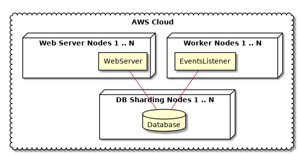

****************************************************
A test project that I would like google not to index
****************************************************

http://axz.enkidulan.tk/login

.. contents::

Requirement
===========

Have installed linux system with following packages:
    * make
    * python3-dev
    * python-virtualenv

How to setup and run project
============================

Project has a ``Makefile`` that provides a set of basic commands for
set up and execution.

Getting list of available commands
----------------------------------

.. code-block:: bash

    make

Set up project
--------------

.. code-block:: bash

     make setup

Run tests
---------

.. code-block:: bash

    make test

Run project
-----------

.. code-block:: bash

    make run

How this can be deployed on AWS?
================================

.. uml::

    @startuml

    cloud "AWS Cloud" {

        node "Worker Nodes 1 .. N" {
            rectangle EventsListener
        }

        node "Web Server Nodes 1 .. N" {
            rectangle WebServer
        }

        node "DB Sharding Nodes 1 .. N" {
            database Database
        }

    }

    EventsListener -- Database
    WebServer -- Database

    @enduml

Bottlenecks and scaling out
===========================

This application can be scaled out very easily, it even does not have DB. The only possible bottlenecks I see is a 3rd party API request limit.
